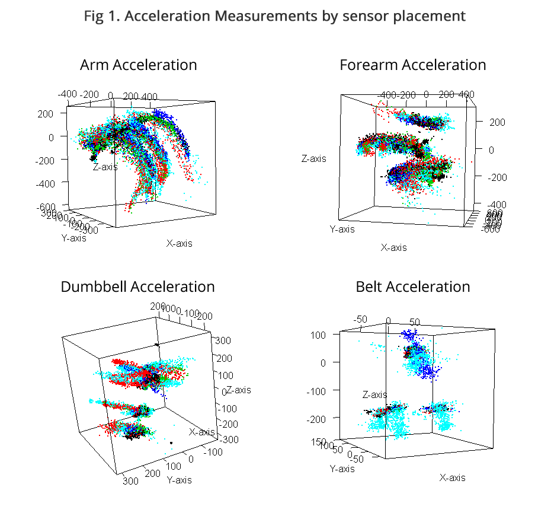

## i. Introduction

Human activity recognition research has traditionally focused on discriminating between different activities, i.e. to predict "which" activity was performed at a specific point in time. This project investigates a dataset attempting to measure "how (well)" an activity was performed as measured by various sensor attached to different parts of the subject's body. The "how (well)" investigation has only received little attention so far, even though it potentially provides useful information for a large variety of applications,such as sports training.


### Description

Six young health participants were asked to perform one set of 10 repetitions of the Unilateral Dumbbell Biceps Curl in five different fashions: exactly according to the specification (Class A), throwing the elbows to the front (Class B), lifting the dumbbell only halfway (Class C), lowering the dumbbell only halfway (Class D) and throwing the hips to the front (Class E).

Tacking devices were mounted in the users' glove, armband, lumbar belt and dumbbell, each containing accerlerometer, gyroscope and magentormeter sensors. 


To see more of the detail, please refer to the original study ["Qualitative Activity Recognition of Weight Lifting Exercises""](http://groupware.les.inf.puc-rio.br/work.jsf?p1=11201)


## ii. Exploratory Analysis

### Setting Up

We begin by loading necessary packages and loading the data.
```{r}
library(caret); library(ISLR); library(ggplot2); library(rgl); library(rpart);library(randomForest);library(corrplot)
pml_training <- read.csv("./data/pml-training.csv") 

pml_testing <- read.csv("./data/pml-testing.csv")

```


The data has already been split up in to a training set and a testing set. Our aim here is to use cross-fold validation to train a model and test the out-of-sample accuracy on the training set, before finally applying it to the testing set to generate our predictions.

### Overview

```{r}
dim(pml_training)

```

The training set consists of 19622 observations of 160 variables. There were a total of 6 subjects participating in the study, performing 5 different excercises, measured by four different wearable devices.


### Visual Analysis

```{r, eval=FALSE}
with(training, plot3d(accel_arm_x, accel_arm_y, accel_arm_z, col = as.numeric(training$classe), 
                      size = 1, xlab = "X-axis", ylab = "Y-axis", zlab = "Z-axis"))

with(training, plot3d(accel_forearm_x, accel_forearm_y, accel_forearm_z, col = as.numeric(training$classe), 
                      size = 1, xlab = "X-axis", ylab = "Y-axis", zlab = "Z-axis")) 

with(training, plot3d(accel_dumbbell_x, accel_dumbbell_y, accel_dumbbell_z, col = as.numeric(training$classe), 
                      size = 1, xlab = "X-axis", ylab = "Y-axis", zlab = "Z-axis"))


with(training, plot3d(accel_belt_x, accel_belt_y, accel_belt_z, col = as.numeric(training$classe), 
                      size = 1.5, xlab = "X-axis", ylab = "Y-axis", zlab = "Z-axis"))

```

Plotting the acceleration from the sensors in three dimensions make it easier to visualize the captured data.

Here the colors correspond as follows:

- **Black:** Correct movement according to the specification (Class A)
- **Red:** Throwing the elbows to the front (Class B)
- **Green:** Lifting the dumbbell only halfway (Class C)
- **Dark Blue:** Lowering the dumbbell only halfway (Class D) 
- **Light Blue:** Throwing the hips to the front (Class E).

That is, all colors other than black represent some kind of error in execution. 

The picture was generated locally and included in the output file.



When looking at acceleration in three dimensions in Fig 1 it is quite easy to see that black, the correct execution of movement, has significantly lower variance than the other colors (representing incorrect motions). For the most part, the black points are clustered tightly together with other colors spreading out widely. Notably, in the belt acceleration plot it's clear that light blue - representing "Thowing the hips to the front" - shows signifant comparative spread, as would be expected.

## iii. Building a Predictive Model

###  Feature Selection

We start off with removing features with near zero variance
```{r}
nsv <- nearZeroVar(pml_training, saveMetrics = T)
reduced.pml_training <- pml_training[, names(pml_training)[!nsv$nzv]]
dim(reduced.pml_training)
```

The new dataset has 100 columns. Of those we remove those with a high rate ( > 50%) of NA values.

```{r}
highNas <- colSums(is.na(reduced.pml_training)) > nrow(reduced.pml_training)/2
lowNAs <- names(reduced.pml_training)[!highNas]
lowNAs

```

From this list we disregard the first 6 columns as they are not strictly measurements, and end up with a final vector of features that can be applied to the training set.

```{r}
features <- lowNAs[7:59]
reduced.training <- pml_training[, features]
```

### Partitioning the Data

We split the data 70/30 between training and testing.
```{r}

inTrain <- createDataPartition(y = reduced.training$classe, p = 0.70, list = F)

training <- reduced.training[inTrain,]
testing <- reduced.training[-inTrain,]

```

### Examining Correlation


```{r}

corrMat <- cor(training[, -53])
corrplot(corrMat, method = "square", order = "FPC", type = "lower", tl.cex = 0.6,  tl.col = rgb(0, 0, 0), outline = F)
```

### Training a Random Forest Predictor Model and Testing for Out-of-sample Accuracy

```{r, cache=TRUE}

set.seed(123)
rfModel <- randomForest(classe ~ ., data = training, proximity = T) 
predictionRF <- predict(rfModel, newdata = testing)
confusionMatrix(predictionRF, testing$classe)
```

A 99.41% is promising indeed. Given that it was fairly easy to see a difference between correctly executed movement and wrong ones we can be fairly confident that this model will do well on the test set.

### Principal Component Analysis

Now let's take a look at the variable importance as measured by our Random Forest model.

```{r}
varImpPlot(rfModel, pch = 20, cex = 0.8, main =  "Variable Importance" )
```

### Applying the Model to Test Data

We are now finally ready to apply our predictive model to the test data.

```{r}
predict(rfModel, newdata = pml_testing)
```
These results have been verified as correct. 

### Conclusion

These initial results show strong promise for the possibility of giving accurate feedback on exercise form based on data from wearable sensors. An interesting followup study would be to randomly select participants who do not know the purpose of the study, and then have exercise professionals score their form and use this data to build a more sopohisticated model that has the potential to detect errors in form under normal excercise conditions.


